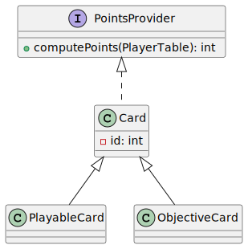
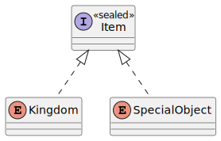
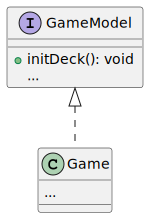
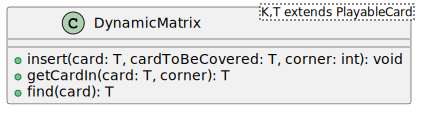
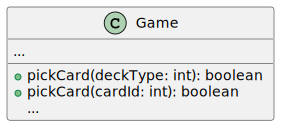

# Peer-Review 1:UML

Zining Chen, Edoardo Bergamo, Ferdinando Maria Cioffi, Osama Atiqi

Gruppo 11

Valutazione del diagramma UML delle classi del gruppo 20.

## Lati positivi

- Il progetto è compatto e ben strutturato, con un numero limitato di classi e interfacce. Questo rende il diagramma UML
  più chiaro e facile da comprendere.

- La scelta di utilizzare un’interfaccia per `PointsProvider` permette una maggiore flessibilità e riutilizzabilità del
  codice, soprattutto per il calcolo dei punti durante il posizionamento e calcolo dei punti degli obiettivi.

- La classe `Card`, insieme alle sue sottoclassi, grazie all'implementazione esclusiva di metodi getter, assicura
  l'immutabilità delle istanze, offrendo così un livello di sicurezza superiore e prevenendo alterazioni non volute.
  Questa caratteristica facilita notevolmente le fasi di testing e manutenzione del codice.

## Lati negativi

### Il controller ha i Players

<!--- aggiunta di edo 30/03/24-->
Alcuni metodi di Game ricevono come parametri delle istanze della classe `Player` ciò implica che il controller ha un
riferimento a queste classi del modello e potrebbe quindi utilizzarne i metodi. Questo tipo di interazione non è
coerente con il design pattern MVC che richiede la creazione di un’interfaccia ideata appositamente per la comunicazione
tra model e controller. Si potrebbe valutare di identificare Players tramite il loro nickname (che da specifica è
univoco) in modo che la distinzione tra controller e model sia più netta.

### Mancano i metodi getter

Assumendo che la classe `Game` si interfacci al controller, non si ha i metodi getter in generale. Questo sarebbe un
problema per l'implementazione di un'interfaccia grafica e testuale, che necessita di informazioni sullo stato del gioco
per poterlo visualizzare.

Ad esempio, potrebbero essere necessari i seguenti metodi:

- Metodi per l'accesso ai dati relativi ai giocatori attualmente in gioco.
- Metodi per la visualizzazione delle carte detenute dai giocatori.
- Metodi per la consultazione del campo di gioco di ciascun giocatore.
- Metodi per l'identificazione delle carte disponibili per il prelievo sul tavolo.
- Metodi per l'acquisizione di informazioni sulle carte obiettivo, sia segrete che comuni.
- Metodi per l'interrogazione del punteggio associato a ciascun giocatore.

Non avendo questi metodi getter il controller dovrebbe occuparsi di mantenere lo stato del gioco, cosa che non dovrebbe
fare.

- Mancano i metodi getter per la classe `Player`,all'interno del modello, per ottenere le carte in mano oppure la carta
  obiettivo attuale.

- La classe `Card` manca il metodo `getId` per ottenere l'id della carta.

- Nell'UML, il metodo `nextPlayer` appare come privato. Tuttavia, potrebbe essere opportuno considerare la sua
  conversione in un metodo pubblico, al fine di fornire al controller un accesso diretto a tale informazione,
  particolarmente utile quando deve gestire i comandi provenienti dai vari giocatori.

### Mancanza di metodi setter

La classe `Game` non ha metodi per aggiungere un giocatore al tavolo, quindi la creazione dei `Player` non è possibile.

### Mancanza di leggibilità

- Nelle carte obiettivo `DiagonalConfiguration` e `VerticalConfiguration` è poco chiaro come si distinguano i diversi
  modi in cui potrebbe essere configurato il pattern.

Abbiamo supposto che venga utilizzato l’attributo `coveredCorner` per indicarlo. Sebbene non sia sbagliato usare degli
numeri interi per rappresentare le diverse configurazioni, può diventare difficile la comprensione per un team. Per
questo motivo consigliamo di usare una Enum per rappresentare i 4 angoli e mappare ogni angolo alla configurazione a cui
appartiene.

Consigliamo anche di usare una Enum per rappresentare gli 4 angoli, in modo da rendere il codice più leggibile.

Nel caso vogliate utilizzare un intero come parametro per rappresentare gli angoli si potrebbe codificare ogni angolo
della Enum a un integer.

```java
public enum Corner {
    TOP_LEFT(0),
    TOP_RIGHT(1),
    BOTTOM_LEFT(2),
    BOTTOM_RIGHT(3);

    private final int value;

    Corner(int value) {
        this.value = value;
    }

    public int Value() {
        return value;
    }
}
```

- Il metodo `PickCard` di `Game` potrebbe essere di difficile comprensione se non si conosce la mappatura del tipo di
  deck al suo intero. Per questo motivo consigliamo di usare una Enum anche per rappresentare i tipi di deck.

```java
public enum DeckType {
    RESOURCE(0),
    GOLD(1);

    private final int value;

    DeckType(int value) {
        this.value = value;
    }

    public int Value() {
        return value;
    }
}
```

### Mancanza di informazioni

- Nella classe Player non è presente l'attributo relativo al colore, nonostante questo rappresenti un elemento
  distintivo per ciascun giocatore nel contesto del gioco fisico.

### Ottimizzazioni facili

- Le strutture dati `HashMap` utilizzate nelle classi `PlayerStats` e `GoldCard` potrebbero essere efficacemente
  rimpiazzate con `EnumMap`, le quali accettano esclusivamente Enum come chiavi. Questa modifica non solo renderebbe
  l'implementazione più efficiente in termini di memoria, ma anche semplice da implementare, dato che entrambe le
  strutture aderiscono all'interfaccia `Map`.

- Per rappresentare il lato della carta scelta si potrebbe sostituire l'attributo `side` con un booleano e si potrebbe
  rinominarlo in `isRetro` per rendere più chiaro il suo significato.

### Possibili miglioramenti

- Potrebbe essere vantaggioso incorporare l'interfaccia `PointsProvider` direttamente all'interno della classe `Card`,
  introducendo un metodo di default che ritorna 0. Questo permetterebbe alle sottoclassi di sovrascrivere il metodo
  qualora attribuissero punti. Durante il gioco, tutte le carte potrebbero essere gestite come istanze di `Card`,
  sfruttando così il polimorfismo ed evitando la necessità di verificare se una carta è di tipo `ObjectiveCard`
  o `PlayableCard`.

<!---
@startuml pointsProvider

interface PointsProvider {
    +computePoints(PlayerTable): int
}

class Card implements PointsProvider {
    -id: int
}

class PlayableCard extends Card

class ObjectiveCard extends Card
@enduml
--->




- Si potrebbe sostituire la classe `Corner` con una interfaccia sigillata(**sealed interface**) di 2 Enum per
  rappresentare un oggetto contenuto, come ci è stato suggerito da Margara.<br>
  Considerando che `Kingdom` e `SpecialObject` sono entità mutualmente esclusive, è possibile definire un'interfaccia
  comune denominata `Item`, implementata da entrambe. Di conseguenza, si potrebbe gestire un array di `Item`, capace di
  ospitare sia elementi di tipo `Kingdom` che `SpecialObject`.

<!---
@startuml sealedInterface

interface Item <<sealed>>

enum Kingdom implements Item

enum SpecialObject implements Item

@enduml
--->



> **_NOTA:_** Si potrebbe pensare anche di aggiungere una terza Enum che implementi `Item` per rappresentare l’angolo
> vuoto e quello bloccato.

- La creazione delle carte essendo una operazione che deve leggere dal disco potrebbe essere lenta e complessa. Si
  potrebbe pensare di usare il Factory pattern per suddividere la logica della creazione dei mazzi e carte. In questo
  modo si potrebbe creare un metodo `createCard` che legge dal disco e crea la carta. Inoltre, considerando la presenza
  di vari tipi di mazzi da instanziare, si potrebbe creare un metodo `createDeck` con parametro il tipo di mazzo da
  creare. <br>
  L'utilizzo del pattern Factory per la creazione di carte e mazzi offre diversi vantaggi in termini di leggibilità,
  manutenibilità ed estensibilità del codice.

- Potrebbe essere opportuno astrarre la classe `Game` attraverso un'interfaccia, in modo da occultare i dettagli
  implementativi sottostanti. Questo approccio non solo garantirebbe una maggiore incapsulazione, ma renderebbe anche
  più evidente quali metodi vengono esposti per l'interazione esterna e quali, invece, rimangono confinati all'interno
  del modello.

<!---
@startuml gameModel
interface GameModel{
+initDeck(): void
{method} ...
}
class Game implements GameModel{
...
}

@enduml
--->



- La struttura dati `DynamicMatrix<K,T>`, come ci è stato chiarito dal gruppo 20, potrebbe risultare di una complessità
  superiore rispetto alle effettive necessità del progetto. Si potrebbe valutare l'opportunità di adottare una `Map`,
  utilizzando la posizione come chiave e la carta come valore. Questa alternativa, oltre a semplificare
  l'implementazione del codice, potrebbe contribuire a renderlo più intuitivo e immediato da comprendere.

Nell'eventualità di voler mantenere inalterata l'attuale struttura, potrebbe essere opportuno ponderare la revisione dei
nomi dei metodi e dei parametri relativi ai metodi `insert`, `get`, `find`, con l'obiettivo di astrarre ulteriormente l'
implementazione dal suo utilizzatore. In parallelo, si dovrebbe applicare un analogo processo di revisione alle
classi `PlayerTable` e `Player`, in particolare per quanto riguarda i metodi `insertCard` e `playCard`.

Inoltre, si potrebbe imporre che il tipo `T` sia una sottoclasse di `PlayableCard`, al fine di prevenire potenziali
errori.

L'uso di un tipo generico `K` per rappresentare la chiave potrebbe risultare superfluo, dato che la chiave è sempre una
stringa contenuta all'interno della carta. Pertanto, si potrebbe valutare l'eliminazione del tipo generico `K`,
permettendo alla classe di derivare autonomamente la chiave dalla carta mediante l'uso del metodo `getId`.


<!---

@startuml dynamicMatrix
class DynamicMatrix<T extends PlayableCard>{
+insert(card: T, cardToBeCovered: T, corner: int): void
+getCardIn(card: T, corner): T
+find(card): T
}
@enduml
--->



- Il metodo `pickCard` potrebbe essere opportunamente scisso in due metodi distinti, al fine di differenziare l'azione
  di pescare una carta da un mazzo da quella di prelevare una carta dal tavolo. Inoltre, l'identificativo univoco della
  carta potrebbe essere utilizzato come parametro per selezionare la carta desiderata dal tavolo.

<!---
@startuml pickCard
class Game{
    ...
    +pickCardFrom(deckType: int): boolean
    +pickCard(cardId: int): boolean
    {method} ...
}
@enduml
--->



> **_NOTA:_** Potrebbe essere presa in considerazione l'opzione di sfruttare la capacità di overload dei metodi,
> definendo due varianti del metodo pickCard con parametri differenti. Questo permetterebbe di distinguere con chiarezza
> le situazioni in cui si desidera pescare una carta da un mazzo da quelle in cui si intende prelevare una carta dal
> tavolo.

### Possibili imperfezioni

- La classe `Deck`, priva di metodi per mescolare le carte o aggiungerne di nuove al mazzo, impone la necessità di
  rigenerare l'intero insieme di carte a ogni nuova partita.

- La funzione `GetVisibleCard` presenta un'ambiguità: non è chiaro se essa preleva una carta dal tavolo restituendola,
  oppure se funge semplicemente da metodo osservatore. Entrambe le interpretazioni portano a problematiche. Nel primo
  caso, non esisterebbe un modo per visualizzare le carte presenti sul tavolo; nel secondo, non vi sarebbe la
  possibilità di raccogliere una carta e sostituirla con un'altra dal mazzo.

- Il metodo `chooseFirstPlayer` di `Game` non ha argomenti, ma si potrebbe dare come argomento la stringa del nome del
  giocatore che si vuole far giocare per primo. Altrimenti il metodo è ridondante se il game fa uno shuffle interno
  perché può essere fatto dopo aver aggiunto tutti i giocatori o all'inizio della partita, come per esempio si potrebbe
  fare nel metodo `giveInitialCards`.

## Confronto tra le architetture

Confrontando le due architetture si nota che quella del gruppo 20 risulta molto più compatta rispetto a quella del
nostro gruppo, questo rende il grafico UML e di conseguenza anche il codice moto più chiaro. La differenza nel numero di
classi utilizzate deriva da un approccio differente: il nostro gruppo ha optato per la creazione di classi di supporto
volte a suddividere i compiti in più parti, oltre alle classi “ovvie” derivanti dalle regole del gioco (
es. `Player`, `PlayerTable`, `ObjectiveCards`…). Sebbene tale scelta possa risultare vantaggiosa in termini di
modularità e riutilizzo del codice, comporta un aumento della complessità del diagramma UML e per codice stesso,
rendendoli meno intuitivi da comprendere.
L’architettura del gruppo 20, pur utilizzando un numero minore di classi, presenta una struttura più coesa e lineare,
favorendo una migliore leggibilità e del codice.
Poiché un alto grado di espandibilità non è un requisito necessario per un progetto di questo tipo (non ci aspettiamo
che un gioco da tavolo subisca grandi modifiche), il nostro gruppo potrebbe puntare a una struttura più compatta e
chiara in modo da ridurre la possibilità di incorrere in bachi.

Un altro aspetto distintivo tra le due architetture risiede nel fatto che il gruppo 20 ha optato per l'implementazione
di un'interfaccia unificata per la gestione di tutte le potenziali assegnazioni di punti. Il nostro gruppo, al
contrario, ha preferito fornire metodi e interfacce separate per le `PlayableCard` e le `ObjectiveCard`. L'approccio del
gruppo 20, che prevede l'unificazione della gestione dei punti in un'unica interfaccia, risulta particolarmente
intrigante per la sua capacità di semplificare l'implementazione del modello. Di conseguenza, stiamo valutando
l'opportunità di integrare un'interfaccia simile nel nostro progetto.

Entrambi i progetti adottano un approccio che promuove l'immutabilità delle classi rappresentanti le carte, limitandosi
all'implementazione di metodi getter e omettendo qualsiasi setter. Tuttavia, nel nostro caso, abbiamo scelto di elevare
ulteriormente il grado di immutabilità facendo ricorso alla libreria **Guava** di Google. Questa scelta è stata guidata
dalla volontà di assicurare l'inalterabilità delle carte in ogni circostanza, particolarmente quando si utilizzano
strutture dati come le `Map`, che, nonostante siano dichiarate final, potrebbero subire modifiche.

Entrambi i progetti hanno preso la decisione di associare direttamente al `Player` il proprio campo di gioco. Tuttavia,
si evidenzia una divergenza nelle scelte implementative: il gruppo 20 ha optato per l'adozione di una `DynamicMatrix`,
facendo uso di `LinkedList` per modellare il tavolo di gioco, mentre il nostro gruppo ha privilegiato l'impiego di
una `HashMap` per la rappresentazione delle carte in campo. La scelta del gruppo 20, che prevede l'impiego di una
struttura dati di maggiore complessità, potrebbe tradursi in un incremento dell'efficienza in termini di gestione della
memoria. Al contrario, la nostra decisione di ricorrere a una `HashMap` potrebbe risultare più immediata e intuitiva da
interpretare per i membri del team e a una maggiore efficienza in termini di accesso ai dati.

<!--- 
[ATTENZIONE DA NON LEGGERE!]
Gruppo Nostro

Complesso il diagramma, il codice oscuro,
classi di supporto, un dedalo sicuro.
Oltre le ovvie, derivate dal gioco,
frammenti sparsi, un mosaico opaco.

Gruppo Venti

Coesa e lineare, architettura snella,
un'unica struttura, ben leggibile e bella.
Minor numero di classi, ma ordinate,
un insieme compatto, ben definite.

Conclusione

Quale scelta migliore, quale via maestra?
Dipende dal progetto, la complessa orchestra.
Manutenibilità e riutilizzo, fattori chiave,
per il team di sviluppo, scelte da vagliare.
-->
